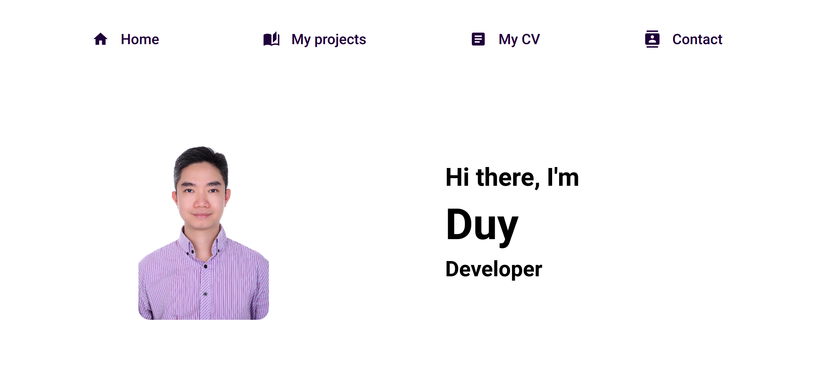

# My Portfolio

This is my portfolio which shows my projects, CV and contact information.

## How to run project

- clone project: `git clone git@github.com:ncongduy/myPortfolio.git`
- In bash type: `npm install`
- Run project in dev environment, type in bash: `npm start`
- Build product environment, type in bash: `npm run build`

Navigate to http://localhost:3000/ in your browser for dev environment.

## Demo image

## Demo link

https://ncongduy.github.io/myPortfolio/

## Author

Code is created by Nguyen Cong Duy. I used starter code from create-react-app.

## Sources

- [React](https://reactjs.org/)
- [React Router Dom](https://reactrouter.com/docs/en/v6/getting-started/overview)
- [node-sass](https://www.npmjs.com/package/node-sass)
- [Material-UI](https://mui.com/)
- [Stackoverflow](https://stackoverflow.com/)
- [W3school](https://www.w3schools.com/)
- [MDN](https://developer.mozilla.org/en-US/)
